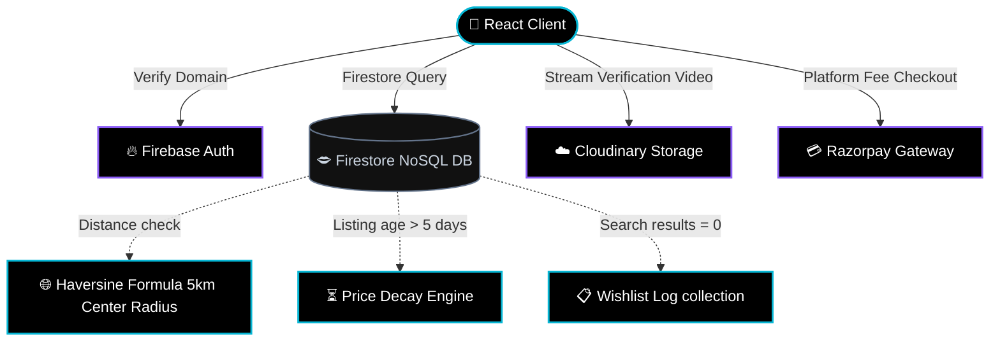

<!--
========================================================================================
   CYBERPUNK GLASSMORPHISM PROFILE | MIHIR GOVIND
   PRODUCTION READY PORTFOLIO FEATURING BMSIT BAZAAR & CONTRIBUTION SNAKE
========================================================================================
-->

  <!-- Animated Capsule Banner -->
  
  
   
  
  <!-- Sub-Header Typing Animation -->
  

  <!-- Metric Badges Row -->
  

    
    
    
  

  <!-- Quick Social Navigation -->
  

    &nbsp;
    &nbsp;
    &nbsp;
    
  

 

 

<!-- ========================================== ABOUT ME TERMINAL ========================================== -->

## 🖥️ SYSTEM TERMINAL: ABOUT_ME.sh

  <!-- Terminal Header -->
  

    

      
      
      
    

    
guest@mihir-govind-server: ~ (bash)

  

  <!-- Terminal Output -->
  

    guest@mihir-govind:~$ cat profile.json
    <pre style="color: #a855f7; margin: 8px 0 15px 15px; font-family: 'Fira Code', monospace; font-size: 13px; line-height: 1.4;">
{
  "name": "Mihir Govind",
  "role": "Backend Developer",
  "location": "India 🇮🇳",
  "bio": "Passionate Backend &amp; Full Stack Developer focused on building scalable, 
         fault-tolerant microservices, Firebase ecosystems, and secure student platforms."
}</pre>
    guest@mihir-govind:~$ systeminfo --learning
    

      &gt;&gt; ACTIVE_STUDY: Spring Boot ✦ Spring AI ✦ Microservices ✦ Docker ✦ Redis ✦ AWS ✦ System Design
    

    guest@mihir-govind:~$ _
  

 

 

<!-- ========================================== TECH STACK ========================================== -->

## ⚡ TECH STACK DASHBOARD

<table width="100%" style="border-collapse: collapse; border: none; background: transparent; border-spacing: 0 8px;">
  <tr style="background: #05050a; border: 1px solid #06b6d4; border-radius: 8px;">
    <td style="padding: 12px; font-family: monospace; font-weight: bold; color: #06b6d4;" width="20%">LANGUAGES</td>
    <td style="padding: 12px;" width="80%">
      
      
      
    </td>
  </tr>
  <tr style="background: #05050a; border: 1px solid #8b5cf6; border-radius: 8px;">
    <td style="padding: 12px; font-family: monospace; font-weight: bold; color: #8b5cf6;" width="20%">BACKEND &amp; INFRA</td>
    <td style="padding: 12px;" width="80%">
      
      
      
      
      
    </td>
  </tr>
  <tr style="background: #05050a; border: 1px solid #d946ef; border-radius: 8px;">
    <td style="padding: 12px; font-family: monospace; font-weight: bold; color: #d946ef;" width="20%">DATABASES</td>
    <td style="padding: 12px;" width="80%">
      
      
      
      
    </td>
  </tr>
  <tr style="background: #05050a; border: 1px solid #06b6d4; border-radius: 8px;">
    <td style="padding: 12px; font-family: monospace; font-weight: bold; color: #06b6d4;" width="20%">FRONTEND</td>
    <td style="padding: 12px;" width="80%">
      
      
      
      
    </td>
  </tr>
  <tr style="background: #05050a; border: 1px solid #8b5cf6; border-radius: 8px;">
    <td style="padding: 12px; font-family: monospace; font-weight: bold; color: #8b5cf6;" width="20%">TOOLS &amp; SERVICES</td>
    <td style="padding: 12px;" width="80%">
      
      
      
      
      
      
    </td>
  </tr>
</table>

 

 

<!-- ========================================== PORTFOLIO PROJECTS ========================================== -->

## 📁 FEATURED PORTFOLIO PROJECTS

### 🛍️ 1. BMSIT Bazaar (Primary Showcase)
> **An exclusive, secure peer-to-peer student marketplace built specifically for the BMS Institute of Technology and Management (BMSIT) community.**

BMSIT Bazaar allows students to securely buy, sell, and request doorstep delivery of study materials, electronics, and hostel gear within the campus network.

#### 🔒 Key Features
*   **Campus-Only Verification:** Domain restricted login exclusively matching `@bmsit.in` institutional emails.
*   **Media Quality Constraints:** Requires exactly 3 photos and an anti-fraud 15MB product video stream via **Cloudinary** for admin verification.
*   **Razorpay Paywall Model:** Contact details of the seller are locked behind a tiered platform fee (ranging from ₹10 to ₹40) dynamically resolved using Razorpay checkout flows.
*   **Haversine Distance Engine:** Doorstep delivery (+₹20) is offered only if GPS distance calculations verify buyer and seller coordinates are within a **5km radius** of college campus coordinates (`13.13406`, `77.56844`).
*   **Listing Decay Reminders:** Listings remaining unsold for >5 days alert the seller to reduce prices to boost dashboard priority.
*   **Empty search logging:** Searches resulting in 0 matches are recorded on a wishlist registry database to inform sellers of current student demand trends.

#### 📊 BMSIT Bazaar System Architecture

---

### ⏳ 2. DropWait
*   **Concept:** Real-time customer queue and waitlist registry server.
*   **Tech Stack:** Node.js, Express.js, MongoDB, Redis Sorted Sets (`ZSET`), Socket.io.
*   **Design Highlight:** Multi-client wait placements managed asynchronously using Redis in memory to support sub-millisecond status rank updates.

---

### 📡 3. Backend REST APIs
*   **Concept:** Standard enterprise REST API template featuring rate-limiting and OpenAI prompt interfaces.
*   **Tech Stack:** Java, Spring Boot, Spring AI.

 

 

<!-- ========================================== GITHUB STATS & METRICS ========================================== -->

## 📊 GITHUB METRICS & ANALYTICS

  <!-- Trophies Section -->
  
  
    

  <!-- Stats Grid -->
  <table width="100%" style="border-collapse: collapse; border: none; background: transparent;">
    <tr style="border: none; background: transparent;">
      <td width="50%" align="center" style="border: none; padding: 5px;">
        
      </td>
      <td width="50%" align="center" style="border: none; padding: 5px;">
        
      </td>
    </tr>
  </table>

   

  <!-- GitHub Activity Graph -->
  

<!-- ========================================== SYSTEM ROADMAP ========================================== -->

## 🗺️ MASTER SYSTEM ROADMAP

- [x] **Master Core JVM Concepts** (Streams API, Lambda, Multithreading)
- [x] **Spring Boot Framework Expertise** (Auto-configuration, Spring Data, OAuth2)
- [x] **Spring AI Integration** (Ollama configurations, local model integrations)
- [ ] **Master AWS Cloud Deployment** (ECS/Fargate, RDS configurations)
- [ ] **Kubernetes Orchestration Deployment** (Ingress routing, POD configurations)

 

 

<!-- ========================================== RANDOM DEV JOKE ========================================== -->

## 💬 ARCHITECT QUOTE & JOKE

<table width="100%" style="border-collapse: collapse; border: none; background: transparent;">
  <tr style="border: none; background: transparent;">
    <td width="50%" style="border: none; padding: 0 10px 0 0;">
      

        <h5 style="color: #8b5cf6; margin: 0 0 5px 0; font-family: monospace; font-size: 12px;">💭 QUOTE</h5>
        

          "The best code is no code at all. The second best is isolated code that can be replaced without side effects."
        

      

    </td>
    <td width="50%" style="border: none; padding: 0 0 0 10px;">
      

        <h5 style="color: #06b6d4; margin: 0 0 5px 0; font-family: monospace; font-size: 12px;">🤖 JOKE</h5>
        

          <b>Q:</b> Why did the Java programmer need glasses? 
          <b>A:</b> Because they couldn't C#!
        

      

    </td>
  </tr>
</table>

 

 

<!-- ========================================== SYSTEM CAPSULE FOOTER ========================================== -->

  <table style="border-collapse: collapse; border: none; background: transparent;">
    <tr style="border: none; background: transparent;">
      <td style="border: none; padding: 0;">
        

          

            ⚡ STATUS: DEPLOYED
            |
            <a href="https://github.com/mihir000777" style="color: #06b6d4; text-decoration: none;">[ BACK TO TOP ]</a>
          

        

      </td>
    </tr>
  </table>
  
   
  
  

    Built with 💜 by Mihir Govind. All rights reserved. System active: 2026.
  

