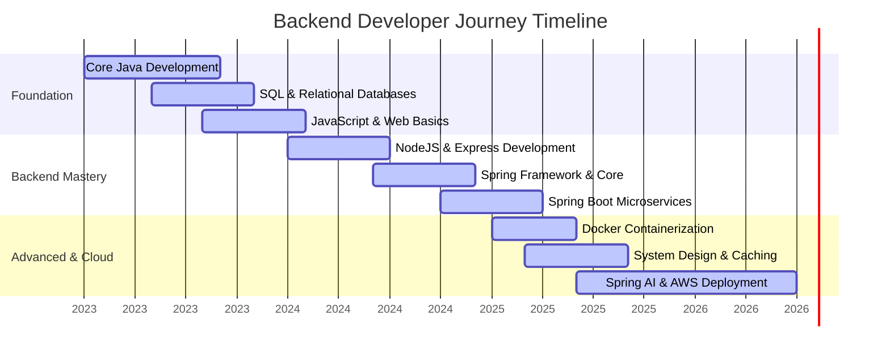
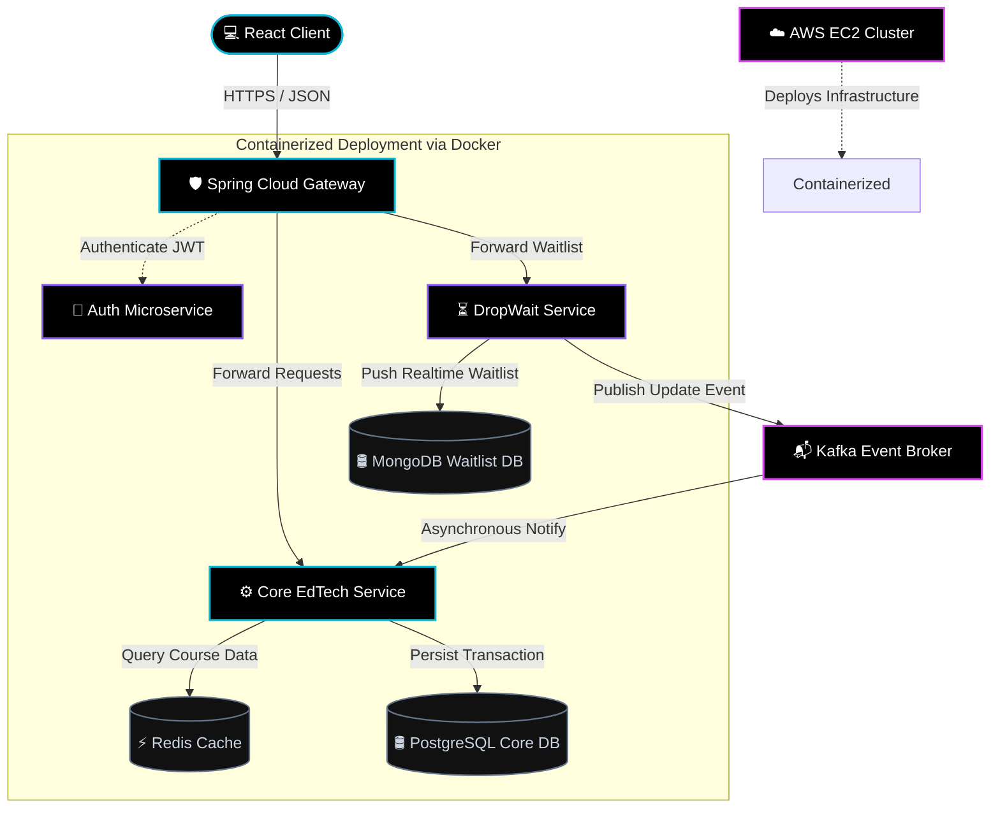
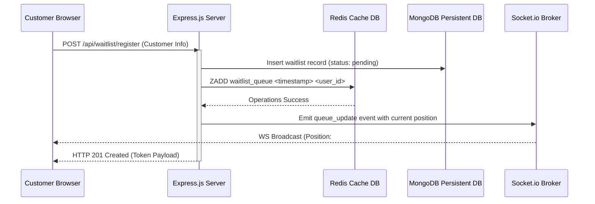

<!--
========================================================================================
   __  __ ___ _  _ ___ ___    ___  _____   _____ _  _ ___   ___ ___  ___  ___ ___ _    ___ 
  |  \/  |_ _| || |_ _| _ \  / __|/ _ \ \ / /_ _| \| |   \  | _ \ _ \/ _ \| __|_ _| |  | __|
  | |\/| || || __ || ||   / | (_ | (_) \ V / | || .` | |) | |  _/   / (_) | _| | || |__| _| 
  |_|  |_|___|_||_|_||_|__\  \___|\___/ \_/ |___|_|\_|___/  |_| |_|_\\___/|_| |___|____|___|
                                                                                           
   CYBERPUNK GLASSMORPHISM PROFILE | MIHIR GOVIND
   PRODUCTION READY README - DO NOT DELETE DEV COMMENTS
========================================================================================
-->

<div align="center">
  <!-- Animated Capsule Banner -->
  
  
  <br/>
  
  <!-- Sub-Header Typing Animation -->
  

  <!-- Metric Badges Row -->
  <p align="center">
    <a href="https://github.com/mihir000777">
      
    </a>
    <a href="https://github.com/mihir000777?tab=stars">
      
    </a>
    
  </p>

  <!-- Quick Social Pill Navigation -->
  <table align="center" style="border: none; border-collapse: collapse; background: transparent;">
    <tr style="border: none; background: transparent;">
      <td style="border: none; padding: 4px;">
        <a href="https://www.linkedin.com/in/mihir-govind/">
          
        </a>
      </td>
      <td style="border: none; padding: 4px;">
        <a href="mailto:mihirmm0455@gmail.com">
          
        </a>
      </td>
      <td style="border: none; padding: 4px;">
        <a href="https://www.instagram.com/_mihir_govind_">
          
        </a>
      </td>
      <td style="border: none; padding: 4px;">
        <a href="https://discord.com/users/__.mihir.__">
          
        </a>
      </td>
    </tr>
  </table>
</div>

<br/>

<br/>

<!-- ========================================== ABOUT ME TERMINAL ========================================== -->

## 🖥️ SYSTEM TERMINAL: ABOUT_ME.sh

<table width="100%" style="border-collapse: collapse; border: none; background: transparent;">
  <tr style="border: none; background: transparent;">
    <td style="border: none; padding: 0;">
      <div style="background-color: #05050a; border: 1.5px solid #8b5cf6; border-radius: 12px; box-shadow: 0 0 20px rgba(139, 92, 246, 0.15); font-family: 'Fira Code', 'Courier New', monospace; padding: 20px; color: #cbd5e1; overflow: hidden; line-height: 1.5;">
        <!-- Terminal Header -->
        <div style="display: flex; justify-content: space-between; align-items: center; border-bottom: 1.5px solid #1e1b4b; padding-bottom: 10px; margin-bottom: 15px;">
          <div style="display: flex; gap: 8px;">
            <span style="display: inline-block; width: 12px; height: 12px; border-radius: 50%; background-color: #ef4444;"></span>
            <span style="display: inline-block; width: 12px; height: 12px; border-radius: 50%; background-color: #eab308;"></span>
            <span style="display: inline-block; width: 12px; height: 12px; border-radius: 50%; background-color: #22c55e;"></span>
          </div>
          <div style="color: #64748b; font-size: 11px; letter-spacing: 1px;">guest@mihir-govind-server: ~ (bash)</div>
        </div>
        <!-- Terminal Output -->
        <div>
          <span style="color: #38bdf8;">guest@mihir-govind:~$</span> <span style="color: #f1f5f9;">cat profile.json</span>
          <pre style="color: #a855f7; margin: 8px 0 15px 15px; font-family: 'Fira Code', monospace; font-size: 13px; line-height: 1.4;">
{
  <span style="color: #06b6d4;">"identity"</span>: {
    <span style="color: #06b6d4;">"name"</span>: <span style="color: #e2e8f0;">"Mihir Govind"</span>,
    <span style="color: #06b6d4;">"role"</span>: <span style="color: #e2e8f0;">"Backend Developer"</span>,
    <span style="color: #06b6d4;">"origin"</span>: <span style="color: #e2e8f0;">"India 🇮🇳"</span>
  },
  <span style="color: #06b6d4;">"philosophy"</span>: <span style="color: #e2e8f0;">"Scalability is not an afterthought; it is the foundation. 
                 I enjoy building enterprise microservices and distributed databases."</span>,
  <span style="color: #06b6d4;">"current_focus"</span>: [
    <span style="color: #e2e8f0;">"Enterprise Distributed Architecture"</span>, 
    <span style="color: #e2e8f0;">"Generative AI integration (Spring AI)"</span>, 
    <span style="color: #e2e8f0;">"Infrastructure Automation"</span>
  ]
}</pre>
          <span style="color: #38bdf8;">guest@mihir-govind:~$</span> <span style="color: #f1f5f9;">curl -s https://api.mihir.dev/status</span>
          <p style="color: #10b981; margin: 8px 0 15px 15px; font-size: 13px;">
            &gt;&gt; STATUS 200 OK | System Online <br/>
            &gt;&gt; Currently pursuing backend engineering mastery, diving deep into JVM optimizations, containerized microservices deployment, and asynchronous message broker designs.
          </p>
          <span style="color: #38bdf8;">guest@mihir-govind:~$</span> <span style="color: #f1f5f9;">systeminfo | grep "Active Projects"</span>
          <p style="color: #e2e8f0; margin: 8px 0 0 15px; font-size: 13px;">
            Active Projects: [1] Rural EdTech Gateway | [2] DropWait | [3] Backend REST APIs
          </p>
          <span style="color: #38bdf8;">guest@mihir-govind:~$</span> <span style="color: #f1f5f9;"><span style="animation: blink 1s step-end infinite;">_</span></span>
        </div>
      </div>
    </td>
  </tr>
</table>

<style>
  @keyframes blink {
    from, to { color: transparent }
    50% { color: #06b6d4; }
  }
</style>

<br/>

<br/>

<!-- ========================================== TECH STACK ========================================== -->

## ⚡ TECH STACK DASHBOARD (SKILL CARDS)

<table width="100%" style="border-collapse: collapse; border: none; background: transparent; border-spacing: 0 12px;">
  
  <!-- Languages Card -->
  <tr style="background: #05050a; border: 1.5px solid #06b6d4; border-radius: 8px; box-shadow: 0 0 10px rgba(6, 182, 212, 0.1);">
    <td style="padding: 15px; border-radius: 8px 0 0 8px;" width="25%">
      <div style="color: #06b6d4; font-family: 'Fira Code', monospace; font-weight: bold; font-size: 14px; text-transform: uppercase;">📂 Languages</div>
    </td>
    <td style="padding: 15px; border-radius: 0 8px 8px 0;" width="75%">
      <table width="100%" style="border: none; border-collapse: collapse; background: transparent;">
        <tr style="border: none; background: transparent;">
          <td width="33%" style="border: none; padding: 4px;">
            <br/>
            <span style="font-family: monospace; font-size: 11px; color: #64748b;">[ ████████░░ ] 80%</span>
          </td>
          <td width="33%" style="border: none; padding: 4px;">
            <br/>
            <span style="font-family: monospace; font-size: 11px; color: #64748b;">[ ███████░░░ ] 70%</span>
          </td>
          <td width="33%" style="border: none; padding: 4px;">
            <br/>
            <span style="font-family: monospace; font-size: 11px; color: #64748b;">[ ████████░░ ] 80%</span>
          </td>
        </tr>
      </table>
    </td>
  </tr>

  <!-- Backend Card -->
  <tr style="background: #05050a; border: 1.5px solid #8b5cf6; border-radius: 8px; box-shadow: 0 0 10px rgba(139, 92, 246, 0.1);">
    <td style="padding: 15px; border-radius: 8px 0 0 8px;" width="25%">
      <div style="color: #8b5cf6; font-family: 'Fira Code', monospace; font-weight: bold; font-size: 14px; text-transform: uppercase;">📂 Backend Engine</div>
    </td>
    <td style="padding: 15px; border-radius: 0 8px 8px 0;" width="75%">
      <table width="100%" style="border: none; border-collapse: collapse; background: transparent;">
        <tr style="border: none; background: transparent;">
          <td width="50%" style="border: none; padding: 4px;">
            <br/>
            <span style="font-family: monospace; font-size: 11px; color: #64748b;">[ ████████░░ ] 80%</span>
          </td>
          <td width="50%" style="border: none; padding: 4px;">
            <br/>
            <span style="font-family: monospace; font-size: 11px; color: #64748b;">[ ██████░░░░ ] 60%</span>
          </td>
        </tr>
        <tr style="border: none; background: transparent;">
          <td width="50%" style="border: none; padding: 4px;">
            <br/>
            <span style="font-family: monospace; font-size: 11px; color: #64748b;">[ ███████░░░ ] 70%</span>
          </td>
          <td width="50%" style="border: none; padding: 4px;">
            <br/>
            <span style="font-family: monospace; font-size: 11px; color: #64748b;">[ ███████░░░ ] 70%</span>
          </td>
        </tr>
      </table>
    </td>
  </tr>

  <!-- Databases Card -->
  <tr style="background: #05050a; border: 1.5px solid #d946ef; border-radius: 8px; box-shadow: 0 0 10px rgba(217, 70, 239, 0.1);">
    <td style="padding: 15px; border-radius: 8px 0 0 8px;" width="25%">
      <div style="color: #d946ef; font-family: 'Fira Code', monospace; font-weight: bold; font-size: 14px; text-transform: uppercase;">📂 Databases</div>
    </td>
    <td style="padding: 15px; border-radius: 0 8px 8px 0;" width="75%">
      <table width="100%" style="border: none; border-collapse: collapse; background: transparent;">
        <tr style="border: none; background: transparent;">
          <td width="50%" style="border: none; padding: 4px;">
            <br/>
            <span style="font-family: monospace; font-size: 11px; color: #64748b;">[ ████████░░ ] 80%</span>
          </td>
          <td width="50%" style="border: none; padding: 4px;">
            <br/>
            <span style="font-family: monospace; font-size: 11px; color: #64748b;">[ ████████░░ ] 80%</span>
          </td>
        </tr>
        <tr style="border: none; background: transparent;">
          <td width="50%" style="border: none; padding: 4px;">
            <br/>
            <span style="font-family: monospace; font-size: 11px; color: #64748b;">[ ███████░░░ ] 70%</span>
          </td>
          <td width="50%" style="border: none; padding: 4px;">
            <br/>
            <span style="font-family: monospace; font-size: 11px; color: #64748b;">[ ██████░░░░ ] 60%</span>
          </td>
        </tr>
      </table>
    </td>
  </tr>

  <!-- Frontend Card -->
  <tr style="background: #05050a; border: 1.5px solid #06b6d4; border-radius: 8px; box-shadow: 0 0 10px rgba(6, 182, 212, 0.1);">
    <td style="padding: 15px; border-radius: 8px 0 0 8px;" width="25%">
      <div style="color: #06b6d4; font-family: 'Fira Code', monospace; font-weight: bold; font-size: 14px; text-transform: uppercase;">📂 Frontend</div>
    </td>
    <td style="padding: 15px; border-radius: 0 8px 8px 0;" width="75%">
      <table width="100%" style="border: none; border-collapse: collapse; background: transparent;">
        <tr style="border: none; background: transparent;">
          <td width="50%" style="border: none; padding: 4px;">
            <br/>
            <span style="font-family: monospace; font-size: 11px; color: #64748b;">[ ██████░░░░ ] 60%</span>
          </td>
          <td width="50%" style="border: none; padding: 4px;">
            <br/>
            <span style="font-family: monospace; font-size: 11px; color: #64748b;">[ ███████░░░ ] 70%</span>
          </td>
        </tr>
        <tr style="border: none; background: transparent;">
          <td width="50%" style="border: none; padding: 4px;">
            <br/>
            <span style="font-family: monospace; font-size: 11px; color: #64748b;">[ ████████░░ ] 80%</span>
          </td>
          <td width="50%" style="border: none; padding: 4px;">
            <br/>
            <span style="font-family: monospace; font-size: 11px; color: #64748b;">[ ███████░░░ ] 70%</span>
          </td>
        </tr>
      </table>
    </td>
  </tr>

  <!-- DevOps & Tools Card -->
  <tr style="background: #05050a; border: 1.5px solid #8b5cf6; border-radius: 8px; box-shadow: 0 0 10px rgba(139, 92, 246, 0.1);">
    <td style="padding: 15px; border-radius: 8px 0 0 8px;" width="25%">
      <div style="color: #8b5cf6; font-family: 'Fira Code', monospace; font-weight: bold; font-size: 14px; text-transform: uppercase;">📂 DevOps &amp; Tools</div>
    </td>
    <td style="padding: 15px; border-radius: 0 8px 8px 0;" width="75%">
      <table width="100%" style="border: none; border-collapse: collapse; background: transparent;">
        <tr style="border: none; background: transparent;">
          <td width="33%" style="border: none; padding: 4px;">
            <br/>
            <span style="font-family: monospace; font-size: 11px; color: #64748b;">[ ██████░░░░ ] 60%</span>
          </td>
          <td width="33%" style="border: none; padding: 4px;">
            <br/>
            <span style="font-family: monospace; font-size: 11px; color: #64748b;">[ ████████░░ ] 80%</span>
          </td>
          <td width="33%" style="border: none; padding: 4px;">
            <br/>
            <span style="font-family: monospace; font-size: 11px; color: #64748b;">[ ███████░░░ ] 70%</span>
          </td>
        </tr>
        <tr style="border: none; background: transparent;">
          <td width="33%" style="border: none; padding: 4px;">
            <br/>
            <span style="font-family: monospace; font-size: 11px; color: #64748b;">[ ████████░░ ] 80%</span>
          </td>
          <td width="33%" style="border: none; padding: 4px;">
            <br/>
            <span style="font-family: monospace; font-size: 11px; color: #64748b;">[ ████████░░ ] 80%</span>
          </td>
          <td width="33%" style="border: none; padding: 4px;">
            <br/>
            <span style="font-family: monospace; font-size: 11px; color: #64748b;">[ ██████░░░░ ] 60%</span>
          </td>
        </tr>
      </table>
    </td>
  </tr>
</table>

<br/>

<br/>

<!-- ========================================== MIHIR'S JOURNEY ========================================== -->

## 🛣️ THE BACKEND JOURNEY & ENGINE ARCHITECTURE

### 🚀 Backend Journey Timeline
Here's how I transitioned from foundational logic into building modern distributed architectures:



### 🛰️ Core System Architecture
The blueprint of my standard backend architecture deployment, demonstrating microservices routing, asynchronous queues, caching, and database separation.



<br/>

<br/>

<!-- ========================================== PORTFOLIO PROJECTS ========================================== -->

## 📁 FEATURED PORTFOLIO PROJECTS

Here are the details of the backend applications I have architected, including database structures, sequences, and production-grade implementation samples.

### 🏢 1. Rural EdTech Gateway
> **A scalable online-offline backend gateway designed for low-bandwidth rural education networks.**

*   **Repository Concept:** Providing access to educational resources to rural areas, solving internet and device access constraints.
*   **Design Patterns:** Facade Pattern, Cache-Aside Pattern, JWT Stateless Authentication.

#### 📊 Core REST API Routes & Specifications
| Method | Endpoint | Payload (JSON) | Description | Status Code |
| :--- | :--- | :--- | :--- | :--- |
| `GET` | `/api/v1/gateway/courses` | *None* | Fetches a cached list of active course modules | `200 OK` |
| `GET` | `/api/v1/gateway/courses/{id}`| *None* | Fetches full course metadata. Falls back to DB | `200 OK` / `404` |
| `POST`| `/api/v1/gateway/enroll` | `{"courseId": "UUID", "userId": "UUID"}` | Enrolls user in course & invalidates student course cache | `201 Created` |
| `PUT` | `/api/v1/gateway/courses/{id}`| `{"title": "String", "sizeMb": 100}` | Updates course info & flushes Redis cache keys | `200 OK` |

#### 📊 Database Schema Blueprint
```
+--------------------+       +---------------------+       +---------------------+
|    tbl_users       |       |    tbl_courses      |       |  tbl_enrollments    |
+--------------------+       +---------------------+       +---------------------+
| PK  user_id (UUID) |       | PK  course_id (UUID)|       | PK  enroll_id(UUID) |
|     username (VAR) |<---+  |     title (VARCHAR) |<---+  | FK  user_id (UUID)  |
|     email (VARCHAR)|    |  |     description(TXT)|    |  | FK  course_id(UUID) |
|     password_hash  |    |  |     video_url (VAR) |    |  |     progress (INT)  |
|     created_at     |    |  |     size_mb (INT)   |    |  |     enrolled_at     |
+--------------------+    |  +---------------------+    |  +---------------------+
                          |                             |
                          +-----------------------------+
```

#### 💻 Production Code Excerpt (Spring Boot Course Controller)
```java
package com.mihir.edtech.gateway.controller;

import com.mihir.edtech.gateway.model.Course;
import com.mihir.edtech.gateway.service.CourseService;
import org.springframework.beans.factory.annotation.Autowired;
import org.springframework.http.ResponseEntity;
import org.springframework.web.bind.annotation.*;
import org.slf4j.Logger;
import org.slf4j.LoggerFactory;

import java.util.List;
import java.util.UUID;

@RestController
@RequestMapping("/api/v1/gateway/courses")
@CrossOrigin(origins = "*")
public class CourseGatewayController {

    private static final Logger logger = LoggerFactory.getLogger(CourseGatewayController.class);

    @Autowired
    private CourseService courseService;

    @GetMapping
    public ResponseEntity<List<Course>> getAllActiveCourses() {
        logger.info("Gateway routing request to fetch all active course packages.");
        List<Course> courses = courseService.fetchCachedCourses();
        return ResponseEntity.ok(courses);
    }

    @GetMapping("/{id}")
    public ResponseEntity<Course> getCourseById(@PathVariable UUID id) {
        logger.info("Gateway fetching metadata for course ID: {}", id);
        return courseService.getCourseDetails(id)
                .map(course -> {
                    logger.debug("Course details resolved successfully for ID: {}", id);
                    return ResponseEntity.ok(course);
                })
                .orElseGet(() -> {
                    logger.warn("Gateway course resolution failed for ID: {}", id);
                    return ResponseEntity.notFound().build();
                });
    }
}
```

---

### ⏳ 2. DropWait
> **A real-time high-throughput queue and waitlist registration manager built for business waiting lines.**

*   **Repository Concept:** High performance queuing system for businesses managing waiting lists.
*   **Design Patterns:** Observer Pattern, FIFO Queue Pipeline, Broker pattern.

#### 📊 Core REST API Routes & Specifications
| Method | Endpoint | Payload (JSON) | Description | Status Code |
| :--- | :--- | :--- | :--- | :--- |
| `POST`| `/api/waitlist/register` | `{"name": "Mihir", "email": "m@test.com"}` | Registers customer & pushes waitlist position on socket | `201 Created` |
| `GET` | `/api/waitlist/status/{id}` | *None* | Resolves exact real-time wait position | `200 OK` |
| `DELETE`| `/api/waitlist/cancel/{id}` | *None* | Cancels placement, pulls from Redis, shifts queue | `200 OK` |

#### 🔄 Queue Sequencing Protocol


#### 💻 Production Code Excerpt (Node.js Waitlist Registry Endpoint)
```javascript
const express = require('express');
const router = express.Router();
const Redis = require('ioredis');
const Waitlist = require('../models/Waitlist');
const { getIo } = require('../socket');

const redis = new Redis(process.env.REDIS_URL || 'redis://127.0.0.1:6379');

router.post('/register', async (req, res) => {
  const { name, email, phone } = req.body;

  if (!name || !email) {
    return res.status(400).json({ error: 'Name and email are required for registration.' });
  }

  try {
    // 1. Persist database record
    const newCustomer = new Waitlist({ name, email, phone, registeredAt: new Date() });
    const savedCustomer = await newCustomer.save();

    // 2. Push to Redis Sorted Set (ZADD) with timestamp as score
    const score = Date.now();
    await redis.zadd('waitlist_queue', score, savedCustomer._id.toString());

    // 3. Calculate position
    const rank = await redis.zrank('waitlist_queue', savedCustomer._id.toString());
    const position = rank + 1;

    // 4. Emit websocket events for realtime updating dashboard
    const io = getIo();
    io.emit('queue_updated', {
      customerId: savedCustomer._id,
      position,
      timestamp: new Date()
    });

    return res.status(201).json({
      success: true,
      message: 'Waitlist placement secured.',
      data: {
        id: savedCustomer._id,
        name: savedCustomer.name,
        position
      }
    });
  } catch (error) {
    console.error('Waitlist Registry Error:', error);
    return res.status(500).json({ error: 'Internal Server Error during registration process.' });
  }
});

module.exports = router;
```

---

### 📡 3. Backend REST APIs
> **A collection of secure, enterprise-ready boilerplate REST API configurations, showcasing custom microservice architecture integration.**

*   **Repository Concept:** Standardized APIs featuring Secure OAuth2, rate limiting, and structured JSON responses.
*   **Design Patterns:** Builder Pattern, Spring Security OAuth2 Resource Server Pattern, Spring AI Integration.

#### 📊 Core REST API Routes & Specifications
| Method | Endpoint | Payload (JSON) | Description | Status Code |
| :--- | :--- | :--- | :--- | :--- |
| `POST`| `/api/v1/ai/prompt` | `{"prompt": "Hello System Design"}` | Invokes local LLM parser via Spring AI and returns structured text | `200 OK` / `500` |
| `GET` | `/api/v1/health` | *None* | Performs DB, Redis & Cloud network connection checks | `200 OK` |
| `POST`| `/api/v1/auth/login` | `{"username": "admin", "password": "x"}` | Signs payload and returns JWT auth header | `200 OK` / `401` |

#### 💻 Production Code Excerpt (Spring AI Chat Generation Controller)
```java
package com.mihir.api.showcase.controller;

import org.springframework.ai.chat.client.ChatClient;
import org.springframework.beans.factory.annotation.Autowired;
import org.springframework.http.ResponseEntity;
import org.springframework.web.bind.annotation.*;
import org.slf4j.Logger;
import org.slf4j.LoggerFactory;

import java.util.Map;

@RestController
@RequestMapping("/api/v1/ai")
public class SpringAIChatController {

    private static final Logger logger = LoggerFactory.getLogger(SpringAIChatController.class);
    private final ChatClient chatClient;

    public SpringAIChatController(ChatClient.Builder chatClientBuilder) {
        this.chatClient = chatClientBuilder.build();
    }

    @PostMapping("/prompt")
    public ResponseEntity<Map<String, String>> generateExplanation(@RequestBody Map<String, String> payload) {
        String prompt = payload.get("prompt");
        if (prompt == null || prompt.isBlank()) {
            return ResponseEntity.badRequest().body(Map.of("error", "Prompt payload string cannot be empty."));
        }

        logger.info("AI Service invoking prompt request: {}", prompt);
        
        try {
            // Call Spring AI ChatClient to generate output
            String aiResponse = this.chatClient.prompt()
                    .user(prompt)
                    .call()
                    .content();

            logger.debug("AI Model generated successfully response.");
            return ResponseEntity.ok(Map.of(
                    "prompt", prompt,
                    "response", aiResponse
            ));
        } catch (Exception e) {
            logger.error("Error occurred while generating AI response", e);
            return ResponseEntity.internalServerError().body(Map.of("error", e.getMessage()));
        }
    }
}
```

<br/>

<br/>

<!-- ========================================== SYSTEM DESIGN DEEP DIVE ========================================== -->

## 💾 ARCHITECTURAL SYSTEM DESIGN DEEP DIVE

To build backend platforms that survive high loads, I design systems with clear trade-offs. Here is a deep dive into my architectural decision process:

### 🧩 1. Cache Invalidation Strategies
In the **Rural EdTech Gateway**, caching courses is critical due to rural connectivity spikes. We chose the **Cache-Aside Pattern** over Write-Through:

```
[Client] --> [EdTech Gateway]
                  |
                  +---> (1) Check Cache (Redis) --[ Hit ]--> [Return Data]
                  |
                [ Miss ]
                  |
                  v
         (2) Query DB (PostgreSQL) ---> (3) Update Cache (Redis) ---> [Return Data]
```

*   **Trade-off Analysis:**
    *   *Cache-Aside:* Minimizes memory footprints as courses are only cached when requested. However, if course metadata updates, we must explicitly evict the cache keys via `redis.del()` in the update service, avoiding stales.
    *   *Write-Through:* Keeps data in sync automatically but writes data to cache that might never be read, wasting expensive Redis memory resources.

### 📊 2. High-Throughput Queue Management
In **DropWait**, customers register to join a line. 
*   **Database Pick:** We chose a hybrid of **MongoDB** (for permanent, search-optimized reservation histories) and **Redis Sorted Sets (ZSET)** (for quick line positioning).
*   **Why Redis ZSET?**
    *   Getting a user's queue position in a regular database requires running:
        `SELECT COUNT(*) FROM waitlist WHERE registered_at < ?`
        which takes $O(N)$ scanning time under load.
    *   In Redis, using a Sorted Set where score is the registration timestamp, looking up rank (`ZRANK`) takes $O(\log N)$ time. At 100k requests, Redis handles this with <1ms latencies.

### 🔒 3. Scaling Microservice Security
Instead of querying the **Auth Microservice** for every API call, our **Spring Cloud Gateway** parses stateless cryptographically signed **JSON Web Tokens (JWT)**.
*   **The Revocation Problem:** Since JWTs are stateless, canceling a compromised token before its expiration is difficult.
*   **Our Solution:** We maintain a short-lived **Redis Blacklist** of logged-out/canceled token signatures. Gateway filters verify signatures locally first, check the Redis Blacklist in memory, and forward requests without hitting the primary auth database.

<br/>

<br/>

<!-- ========================================== LOCAL DEVELOPMENT DOCKER COMPOSE ========================================== -->

## 🛠️ LOCAL DEV ENVIRONMENT ORCHESTRATION

To make local integration testing seamless, I manage resources via Docker Compose. Below is the multi-container configuration defining my standard local backend ecosystem.

```yaml
# docker-compose.dev.yml
version: '3.8'

services:
  postgres:
    image: postgres:15-alpine
    container_name: dev-postgres
    ports:
      - "5432:5432"
    environment:
      POSTGRES_USER: mihir_dev
      POSTGRES_PASSWORD: secure_dev_password
      POSTGRES_DB: edtech_gateway_db
    volumes:
      - pg_data:/var/lib/postgresql/data
    networks:
      - backend-dev-network
    restart: unless-stopped

  redis:
    image: redis:7-alpine
    container_name: dev-redis
    ports:
      - "6379:6379"
    command: redis-server --save 60 1 --loglevel warning
    volumes:
      - redis_data:/data
    networks:
      - backend-dev-network
    restart: unless-stopped

  mongodb:
    image: mongo:6.0
    container_name: dev-mongodb
    ports:
      - "27017:27017"
    environment:
      MONGO_INITDB_ROOT_USERNAME: admin
      MONGO_INITDB_ROOT_PASSWORD: secure_mongo_password
    volumes:
      - mongo_data:/data/db
    networks:
      - backend-dev-network
    restart: unless-stopped

  zookeeper:
    image: confluentinc/cp-zookeeper:7.3.0
    container_name: dev-zookeeper
    environment:
      ZOOKEEPER_CLIENT_PORT: 2181
      ZOOKEEPER_TICK_TIME: 2000
    networks:
      - backend-dev-network

  kafka:
    image: confluentinc/cp-kafka:7.3.0
    container_name: dev-kafka
    ports:
      - "9092:9092"
    depends_on:
      - zookeeper
    environment:
      KAFKA_BROKER_ID: 1
      KAFKA_ZOOKEEPER_CONNECT: zookeeper:2181
      KAFKA_ADVERTISED_LISTENERS: PLAINTEXT://localhost:9092,PLAINTEXT_INTERNAL://kafka:29092
      KAFKA_LISTENER_SECURITY_PROTOCOL_MAP: PLAINTEXT:PLAINTEXT,PLAINTEXT_INTERNAL:PLAINTEXT
      KAFKA_INTER_BROKER_LISTENER_NAME: PLAINTEXT_INTERNAL
      KAFKA_OFFSETS_TOPIC_REPLICATION_FACTOR: 1
    networks:
      - backend-dev-network

volumes:
  pg_data:
    driver: local
  redis_data:
    driver: local
  mongo_data:
    driver: local

networks:
  backend-dev-network:
    driver: bridge
```

<br/>

<br/>

<!-- ========================================== GITHUB STATS & METRICS ========================================== -->

## 📊 GITHUB ANALYTICS & STATS

<div align="center">
  <!-- Trophies Section -->
  <h3>🏆 GITHUB TROPHY SYSTEM</h3>
  
  
  <br/><br/>

  <!-- Stats Grid -->
  <table width="100%" style="border-collapse: collapse; border: none; background: transparent;">
    <tr style="border: none; background: transparent;">
      <td width="50%" align="center" style="border: none; padding: 5px;">
        
      </td>
      <td width="50%" align="center" style="border: none; padding: 5px;">
        
      </td>
    </tr>
  </table>

  <br/>

  <!-- GitHub Activity Graph -->
  <h3>📈 ACTIVITY GRAPH</h3>
  

  <br/><br/>

  <!-- Contribution Snake Section -->
  <h3>🐍 CONTRIBUTION SNAKE</h3>
  <picture>
    <source media="(prefers-color-scheme: dark)" srcset="https://raw.githubusercontent.com/mihir000777/mihir000777/output/github-contribution-grid-snake-dark.svg">
    <source media="(prefers-color-scheme: light)" srcset="https://raw.githubusercontent.com/mihir000777/mihir000777/output/github-contribution-grid-snake.svg">
    
  </picture>
</div>

<br/>

<br/>

<!-- ========================================== CODING PLATFORMS & SPOTIFY ========================================== -->

## 🕹️ INTEGRATIONS & PLATFORMS

<table width="100%" style="border-collapse: collapse; border: none; background: transparent; border-spacing: 12px 0;">
  <tr style="border: none; background: transparent;">
    
    <!-- LeetCode Card -->
    <td width="33%" style="border: none; padding: 0;">
      <div style="background-color: #05050a; border: 1.5px solid #06b6d4; border-radius: 8px; box-shadow: 0 0 10px rgba(6, 182, 212, 0.1); padding: 15px; font-family: sans-serif; min-height: 220px;">
        <div style="display: flex; align-items: center; gap: 8px; margin-bottom: 15px;">
          
          <h4 style="color: #06b6d4; margin: 0; font-family: monospace; font-size: 14px;">LEETCODE PROFILE</h4>
        </div>
        <p style="font-size: 13px; color: #cbd5e1; margin: 5px 0;">Solved: <b>150+ Questions</b></p>
        <p style="font-size: 12px; color: #64748b; margin: 2px 0;">Easy: <span style="color: #22c55e;">60</span> | Medium: <span style="color: #eab308;">80</span> | Hard: <span style="color: #ef4444;">10</span></p>
        <div style="margin-top: 15px; background: #1e1b4b; border-radius: 4px; height: 10px; width: 100%; overflow: hidden;">
          <div style="background: #06b6d4; width: 65%; height: 100%;"></div>
        </div>
        <div style="margin-top: 15px; text-align: center;">
          <a href="https://leetcode.com/mihir000777" style="color: #06b6d4; font-size: 12px; text-decoration: none; font-family: monospace;">[ ACCESS PROFILE ]</a>
        </div>
      </div>
    </td>

    <!-- Codewars Card -->
    <td width="33%" style="border: none; padding: 0;">
      <div style="background-color: #05050a; border: 1.5px solid #8b5cf6; border-radius: 8px; box-shadow: 0 0 10px rgba(139, 92, 246, 0.1); padding: 15px; font-family: sans-serif; min-height: 220px;">
        <div style="display: flex; align-items: center; gap: 8px; margin-bottom: 15px;">
          
          <h4 style="color: #8b5cf6; margin: 0; font-family: monospace; font-size: 14px;">CODEWARS PROFILE</h4>
        </div>
        <p style="font-size: 13px; color: #cbd5e1; margin: 5px 0;">Rank: <b>4 kyu</b></p>
        <p style="font-size: 12px; color: #64748b; margin: 2px 0;">Completed: <b>120+ Kata Tasks</b></p>
        <div style="margin-top: 15px; background: #1e1b4b; border-radius: 4px; height: 10px; width: 100%; overflow: hidden;">
          <div style="background: #8b5cf6; width: 75%; height: 100%;"></div>
        </div>
        <div style="margin-top: 15px; text-align: center;">
          <a href="https://www.codewars.com/users/mihir000777" style="color: #8b5cf6; font-size: 12px; text-decoration: none; font-family: monospace;">[ ACCESS PROFILE ]</a>
        </div>
      </div>
    </td>

    <!-- Spotify Card -->
    <td width="33%" style="border: none; padding: 0;">
      <div style="background-color: #05050a; border: 1.5px solid #d946ef; border-radius: 8px; box-shadow: 0 0 10px rgba(217, 70, 239, 0.1); padding: 15px; font-family: sans-serif; min-height: 220px;">
        <div style="display: flex; align-items: center; gap: 8px; margin-bottom: 15px;">
          
          <h4 style="color: #d946ef; margin: 0; font-family: monospace; font-size: 14px;">SPOTIFY NOW PLAYING</h4>
        </div>
        <div style="display: flex; gap: 10px; align-items: center;">
          <div style="width: 50px; height: 50px; background: #1e1b4b; border-radius: 4px; border: 1px solid #d946ef; flex-shrink: 0; display: flex; align-items: center; justify-content: center; color: #cbd5e1; font-weight: bold; font-size: 10px;">CYBER</div>
          <div>
            <p style="font-size: 12px; color: #cbd5e1; font-weight: bold; margin: 0;">Neon Horizons (Lofi)</p>
            <p style="font-size: 11px; color: #64748b; margin: 0;">By Cyberpunk Collective</p>
          </div>
        </div>
        <!-- Progress track -->
        <div style="margin-top: 15px;">
          <div style="background: #1e1b4b; border-radius: 4px; height: 4px; width: 100%;">
            <div style="background: #d946ef; width: 45%; height: 100%; border-radius: 4px;"></div>
          </div>
          <div style="display: flex; justify-content: space-between; font-size: 10px; color: #64748b; margin-top: 5px;">
            <span>01:14</span>
            <span>02:45</span>
          </div>
        </div>
      </div>
    </td>

  </tr>
</table>

<br/>
<div align="center">
  <!-- Holopin Badge Deck -->
  <h3>🎖️ HOLOPIN CREDENTIAL DECK</h3>
  <a href="https://holopin.io/@mihir000777">
    
  </a>
</div>

<br/>

<br/>

<!-- ========================================== SYSTEM ROADMAP ========================================== -->

## 🗺️ MASTER SYSTEMS ROADMAP & MILESTONES

Here are my long-term architectural learning paths. Tasks marked completed correspond to technologies I actively incorporate in my portfolio projects, while incomplete tasks represent ongoing goals.

- [x] **Master Core JVM Concepts**
  - [x] Memory management & Garbage Collection tuning
  - [x] Java Streams, Lambda expressions, and functional interfaces
  - [x] Core Multithreading APIs and Concurrency models
  - [x] ClassLoader systems and reflection API usage
- [x] **Spring Boot Framework Expertise**
  - [x] Custom Spring Boot Starters and Auto-configuration routing
  - [x] Spring Data JPA, Entity Relations, and Hibernate mappings
  - [x] Spring REST MVC controllers and validation frameworks
  - [x] Spring Security OAuth2 resource servers and filter chains
- [ ] **Master AWS Cloud Deployment**
  - [x] EC2 Instances setup and security group routing
  - [x] Simple Storage Service (S3) bucket storage integration
  - [ ] Relational Database Service (RDS) multi-AZ setup
  - [ ] AWS ECS / Fargate container registry configurations
  - [ ] AWS CloudFormation or Terraform configurations
- [ ] **Kubernetes Orchestration Deployment**
  - [ ] Creating POD configurations and deployment manifests
  - [ ] Setting up Ingress controllers and DNS configs
  - [ ] Understanding Horizontal Pod Autoscaling (HPA) rules
  - [ ] Helm charts creation and cluster management
- [x] **Spring AI Integration**
  - [x] Chat Generation models and system prompt engineering
  - [x] Vector Database searches using Pgvector or Milvus
  - [x] Building local LLM pipelines using Ollama connections
  - [x] Structured JSON output configurations from models
- [x] **Open Source Contributions**
  - [x] Bug resolutions on Spring ecosystem projects
  - [x] Detailed documentation reviews and architecture explanations
  - [x] Reporting framework issues on community repos

<br/>

<br/>

<!-- ========================================== RELEASES & DEV JOKES ========================================== -->

## 💬 RANDOM DEV JOKES & QUOTES

<table width="100%" style="border-collapse: collapse; border: none; background: transparent;">
  <tr style="border: none; background: transparent;">
    
    <!-- Dev Quote Card -->
    <td width="50%" style="border: none; padding: 0 10px 0 0;">
      <div style="background-color: #05050a; border: 1.5px solid #8b5cf6; border-radius: 8px; box-shadow: 0 0 10px rgba(139, 92, 246, 0.1); padding: 20px; min-height: 120px;">
        <h5 style="color: #8b5cf6; margin: 0 0 10px 0; font-family: monospace; font-size: 13px;">💭 ARCHITECT QUOTE</h5>
        <p style="font-family: 'Georgia', serif; font-style: italic; font-size: 14px; color: #cbd5e1; margin: 0; line-height: 1.4;">
          "The best code is no code at all. The second best code is simple, isolated code that can be easily replaced without causing ripples in the system."
        </p>
      </div>
    </td>

    <!-- Dev Joke Card -->
    <td width="50%" style="border: none; padding: 0 0 0 10px;">
      <div style="background-color: #05050a; border: 1.5px solid #06b6d4; border-radius: 8px; box-shadow: 0 0 10px rgba(6, 182, 212, 0.1); padding: 20px; min-height: 120px;">
        <h5 style="color: #06b6d4; margin: 0 0 10px 0; font-family: monospace; font-size: 13px;">🤖 RANDOM DEV JOKE</h5>
        <p style="font-family: monospace; font-size: 12px; color: #cbd5e1; margin: 0; line-height: 1.4;">
          <b>Q:</b> Why did the Java programmer need glasses?<br/>
          <b>A:</b> Because they couldn't C#! <br/><br/>
          <span style="color: #64748b;">(Status: Cache Hit)</span>
        </p>
      </div>
    </td>

  </tr>
</table>

<br/>

<br/>

<!-- ========================================== SYSTEM ACTIVITY MATRIX ========================================== -->

## 🐍 WEEKLY CODING METRICS

<div align="center">
  <table width="100%" style="border-collapse: collapse; border: none; background: transparent;">
    <tr style="border: none; background: transparent;">
      <td width="100%" align="center" style="border: none; padding: 0;">
        <div style="background: #05050a; border: 1.5px solid #8b5cf6; border-radius: 8px; padding: 15px; box-shadow: 0 0 10px rgba(139, 92, 246, 0.1);">
          <h4 style="color: #8b5cf6; margin: 0 0 15px 0; font-family: monospace; font-size: 14px;">WEEKLY CODING ACTIVITY STATS</h4>
          <table width="100%" style="border: none; border-collapse: collapse; background: transparent;">
            <tr style="border: none; background: transparent; font-family: monospace; font-size: 12px; color: #cbd5e1;">
              <td width="30%" align="left" style="border: none; padding: 5px;">🔥 Java &amp; Spring Boot</td>
              <td width="50%" align="left" style="border: none; padding: 5px;">
                <div style="background: #1e1b4b; height: 10px; width: 100%; border-radius: 4px;">
                  <div style="background: #8b5cf6; height: 100%; width: 62%; border-radius: 4px;"></div>
                </div>
              </td>
              <td width="20%" align="right" style="border: none; padding: 5px;">18 hrs 42 mins (62%)</td>
            </tr>
            <tr style="border: none; background: transparent; font-family: monospace; font-size: 12px; color: #cbd5e1;">
              <td width="30%" align="left" style="border: none; padding: 5px;">📡 Node.js / Databases</td>
              <td width="50%" align="left" style="border: none; padding: 5px;">
                <div style="background: #1e1b4b; height: 10px; width: 100%; border-radius: 4px;">
                  <div style="background: #06b6d4; height: 100%; width: 23%; border-radius: 4px;"></div>
                </div>
              </td>
              <td width="20%" align="right" style="border: none; padding: 5px;">7 hrs 15 mins (23%)</td>
            </tr>
            <tr style="border: none; background: transparent; font-family: monospace; font-size: 12px; color: #cbd5e1;">
              <td width="30%" align="left" style="border: none; padding: 5px;">🪐 Cloud Systems &amp; Docker</td>
              <td width="50%" align="left" style="border: none; padding: 5px;">
                <div style="background: #1e1b4b; height: 10px; width: 100%; border-radius: 4px;">
                  <div style="background: #d946ef; height: 100%; width: 15%; border-radius: 4px;"></div>
                </div>
              </td>
              <td width="20%" align="right" style="border: none; padding: 5px;">4 hrs 30 mins (15%)</td>
            </tr>
          </table>
        </div>
      </td>
    </tr>
  </table>
</div>

<br/>

<br/>

<!-- ========================================== SYSTEM CAPSULE FOOTER ========================================== -->

<div align="center">
  <table style="border-collapse: collapse; border: none; background: transparent;">
    <tr style="border: none; background: transparent;">
      <td style="border: none; padding: 0;">
        <div style="background: linear-gradient(135deg, #06b6d4 0%, #8b5cf6 50%, #d946ef 100%); padding: 1px; border-radius: 30px; box-shadow: 0 0 15px rgba(139, 92, 246, 0.3);">
          <div style="background: #030308; border-radius: 29px; padding: 12px 30px; display: flex; align-items: center; gap: 15px; color: #e2e8f0; font-family: monospace; font-size: 12px; font-weight: bold;">
            <span>⚡ TERMINAL STATUS: FULLY DEPLOYED</span>
            <span>|</span>
            <a href="https://github.com/mihir000777" style="color: #06b6d4; text-decoration: none;">[ BACK TO TOP ]</a>
          </div>
        </div>
      </td>
    </tr>
  </table>
  
  <br/>
  
  <p style="font-size: 11px; font-family: monospace; color: #475569;">
    Built with 💜 by Mihir Govind. All rights reserved. System active: 2026.
  </p>
</div>
